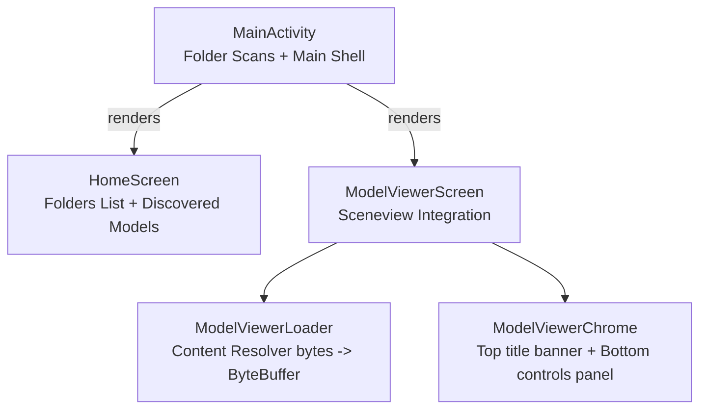

# Filion - Developer Documentation

> Architecture, implementation notes, conventions, and verification guidance for Filion development.

**Version:** 0.0.1 | **Last Updated:** 2026-07-12
**Scope:** Internal development, 3D rendering architecture, SAF directory scanning, and testing.

---

## Table of Contents

- [Architecture Overview](#architecture-overview)
- [Project Structure](#project-structure)
- [Scan Folders Pipeline](#scan-folders-pipeline)
- [3D Rendering Engine](#3d-rendering-engine)
- [Theming & M3 Expressive](#theming--m3-expressive)
- [Build & Run](#build--run)
- [Testing](#testing)

---

## Architecture Overview

Filion is structured as a single-module, lightweight Jetpack Compose application designed to load 3D GLB models.



### Key Architectural Decisions

| Decision | Rationale |
|----------|-----------|
| **SAF DocumentTree Scanning** | Bypasses restrictive Scoped Storage limitations. Users choose custom directories (like Downloads/3D), and Filion queries the child documents tree using `DocumentsContract` and `ContentResolver` recursively. |
| **Stream-to-Buffer Loader** | Content URIs shared by other applications are converted to a raw byte array via `openInputStream` and wrapped in a `ByteBuffer`. This eliminates sceneview URI-resolution errors. |
| **Variable font typography** | Implements the Google Sans Flex variable font family, generating runtime font weights, widths, and optical sizing dynamically. |
| **No-Internet Policy** | The app request manifest does not include `android.permission.INTERNET` to ensure absolute privacy for local CAD/3D designs. |

---

## Project Structure

```text
filion/
├── filion-app/
│   ├── app/
│   │   ├── src/main/java/dev/qtremors/filion/
│   │   │   ├── MainActivity.kt                  # Entry point, SAF folder persistency, and HomeScreen UI
│   │   │   ├── theme/                           # Color, Theme, Type, and VariableFontFactory
│   │   │   ├── ui/                              # Split buttons, custom menu items, cards, and dialogs
│   │   │   └── viewer/                          # Sceneview integrations, overlays, state types, and loaders
│   │   ├── src/main/res/                        # Drawable icons, layout settings, strings, and fonts
│   │   └── src/test/java/                       # State unit tests
```

---

## Scan Folders Pipeline

Filion stores directory permissions persistently:
1. User selects a folder tree using `OpenDocumentTree()`.
2. Persistable read permissions are acquired:
   ```kotlin
   contentResolver.takePersistableUriPermission(uri, Intent.FLAG_GRANT_READ_URI_PERMISSION)
   ```
3. Folder URI references are saved in `SharedPreferences`.
4. Child items are scanned using `DocumentsContract.buildChildDocumentsUriUsingTree` with depth limits:
   - Queries `COLUMN_DOCUMENT_ID`, `COLUMN_DISPLAY_NAME`, `COLUMN_MIME_TYPE`, and `COLUMN_SIZE`.
   - Filters for subfolders and `.glb` matches.

---

## 3D Rendering Engine

Filion renders models using Google's Filament:
- **Renderer**: `SceneView` Composable node.
- **Lighting**: Direct main lighting (10,000 intensity) and fill light (3,000 intensity) multiplied by the user's brightness slider state.
- **Node Scaling**: Modulates scale matrices on gesture listeners Confirmed taps hide overlay UI chrome.

---

## Theming & M3 Expressive

Expressive styling is defined under `dev.qtremors.filion.theme`:
- `GSFlexPreset.EXPRESSIVE` builds display typography using extreme axes (`weight = 950f`, `width = 85f`, `roundness = 100f`).
- `GSFlexPreset.COMPACT` and `GSFlexPreset.NEO` generate standard reading scales.
- Accent colors fall back to Material 3 dynamic color styling.

---

## Build & Run

### Debug Build
```bash
cd filion-app
./gradlew assembleDebug
```

### Run Tests
```bash
./gradlew testDebugUnitTest
```

---

## Testing

Unit tests live under `src/test/java/dev/qtremors/filion/viewer/`:
- **ModelViewerStateTest**: Asserts initial viewer state settings and active control drawer toggle logic.
