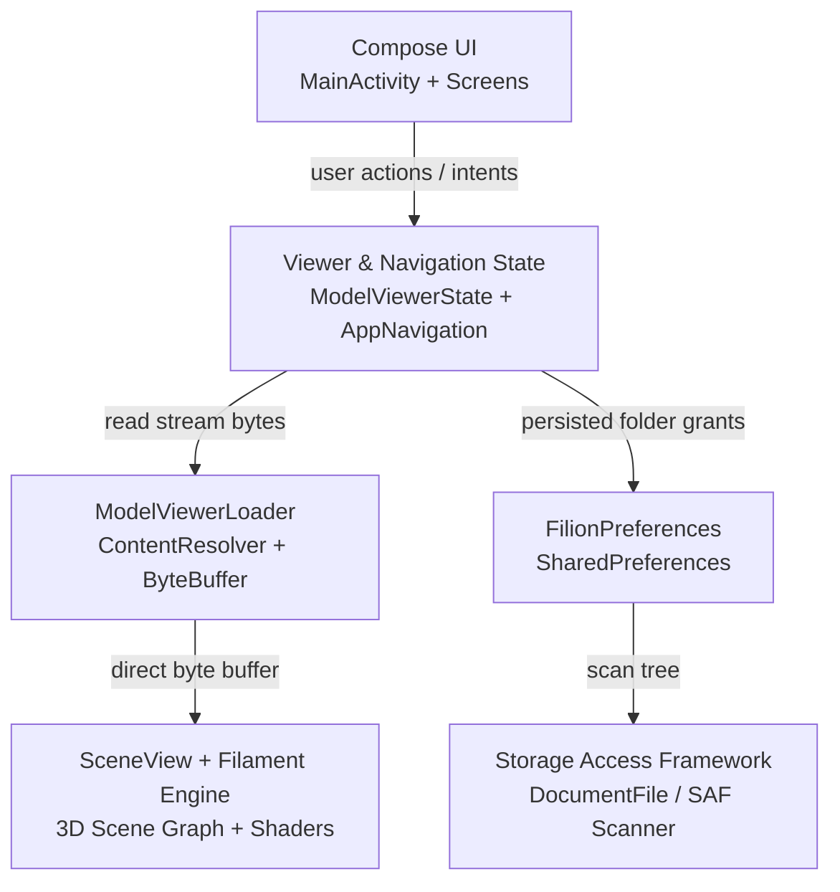

# Filion - Developer Documentation

> Architecture, implementation notes, conventions, and verification guidance for Filion development.

**Version:** 0.0.8 | **Last Updated:** 2026-08-30
**Scope:** Internal development, 3D rendering architecture, UI paradigms, testing, and release maintenance.

---

## Table of Contents

- [Architecture Overview](#architecture-overview)
- [Technology Stack](#technology-stack)
- [Project Structure](#project-structure)
- [Runtime Flow](#runtime-flow)
- [Core Concepts](#core-concepts)
- [Navigation & State](#navigation--state)
- [Model Loading & 3D Rendering](#model-loading--3d-rendering)
- [Folder Scanning & SAF Grants](#folder-scanning--saf-grants)
- [Viewer Controls & Chrome](#viewer-controls--chrome)
- [Naming Conventions](#naming-conventions)
- [Configuration](#configuration)
- [Security & Privacy Practices](#security--privacy-practices)
- [Error Handling](#error-handling)
- [Testing Suite](#testing-suite)
- [Build & Release Engineering](#build--release-engineering)
- [Project Auditing & Quality Standards](#project-auditing--quality-standards)

---

## Architecture Overview

Filion is a **focused Android 3D model viewer application** built with Jetpack Compose, Kotlin Coroutines, and Google Filament / SceneView. It uses clean MVVM patterns, immutable state models, and explicit Storage Access Framework (SAF) URI handling.


```mermaid
graph TD
    A["Compose UI<br/>MainActivity + Screens"] -->|user actions / intents| B["Viewer & Navigation State<br/>ModelViewerState + AppNavigation"]
    B -->|read stream bytes| C["ModelViewerLoader<br/>ContentResolver + ByteBuffer"]
    C -->|direct byte buffer| D["SceneView + Filament Engine<br/>3D Scene Graph + Shaders"]
    B -->|persisted folder grants| E["FilionPreferences<br/>SharedPreferences"]
    E -->|scan tree| F["Storage Access Framework<br/>DocumentFile / SAF Scanner"]
```

### Key Architectural Decisions

| Decision | Rationale |
|----------|-----------|
| **Content URI Streaming to ByteBuffer** | Direct file paths fail on modern Android document providers. Streaming bytes through `ContentResolver` into a `ByteBuffer` ensures 100% compatibility across SAF, downloads, and third-party file managers. |
| **Independent Viewer State** | Model loading, touch gestures, lighting controls, and background selection are decoupled so viewer state changes never trigger redundant model reloads. |
| **Offline-First Privacy** | The manifest explicitly blocks `android.permission.INTERNET` to guarantee that 3D assets and device metadata never leave the device. |
| **Persistent Folder Grants** | Android SAF tree URIs are saved with persistable read permissions so user-selected model folders remain accessible across app restarts. |
| **ProGuard & R8 Optimization** | R8 minification and resource shrinking are configured with dedicated keep rules for Filament native C++ JNI bridges and SceneView classes. |
| **CPU Architecture Splits** | Per-ABI APK splits reduce download and install size by ~60% on 64-bit ARM devices while providing a universal fallback APK. |

---

## Technology Stack

| Area | Technology |
|------|------------|
| Language and toolchain | Kotlin 2.4.10, Java 21 Gradle daemon, JVM 11 bytecode target, Gradle 9.5.0, Android Gradle Plugin 9.3.1 |
| Android platform | compileSdk/targetSdk 37, minSdk 30, AndroidX Core KTX, Lifecycle Runtime KTX, Activity Compose |
| UI and Design | Jetpack Compose BOM 2026.08.00, Material 3 1.5.0-alpha26, Material Icons Extended |
| 3D Graphics & Engine | Google Filament 1.72.0 (filament-android, gltfio-android, utils) and SceneView 4.18.0 |
| State and concurrency | Kotlin Coroutines Android 1.11.0, StateFlow, immutable data models |
| Persistence | SharedPreferences (FilionPreferences) for themes and persisted SAF folder tree URIs |
| Verification & Testing | JUnit 4, Robolectric 4.16.1 (SDK 34), custom Gradle build-logic conventions |

Versions are centralized in [filion-app/gradle/libs.versions.toml](file:///x:/Github/filion/filion-app/gradle/libs.versions.toml).

---

## Project Structure

```text
filion-app/
├── app/
│   ├── proguard-rules.pro    R8 rules for Filament, SceneView, and app models
│   ├── build.gradle.kts      App module build configuration, packaging, and ABI splits
│   └── src/
│       ├── main/
│       │   ├── AndroidManifest.xml   App manifest with GLB intent filters
│       │   ├── java/dev/qtremors/filion/
│       │   │   ├── MainActivity.kt       App shell, intent receiver, and SAF pickers
│       │   │   ├── AppNavigation.kt      Navigation state and screen routing
│       │   │   ├── about/                About and license screens
│       │   │   ├── settings/             Settings UI and FilionPreferences
│       │   │   ├── theme/                Compose Material 3 theme and colors
│       │   │   ├── ui/                   Shared UI components (buttons, dropdowns)
│       │   │   └── viewer/               ModelViewerScreen, Chrome, State, and Loader
│       │   └── res/                      Strings, icons, XML themes, and backup rules
│       └── test/
│           └── java/dev/qtremors/filion/ App navigation, preferences, and viewer tests
├── build-logic/                          Composite build for conventions and verification
│   └── src/main/kotlin/dev/qtremors/filion/buildlogic/
│       └── FilionAndroidApplicationConventionsPlugin.kt
└── gradle/
    └── libs.versions.toml                Centralized version catalog
```

---

## Runtime Flow

1. **Intent Launch / Picker Selection**:
   The user opens a `.glb` file from a file manager or selects a file via Filion's system picker.
2. **URI Resolution**:
   `MainActivity` receives the content URI and passes it to `ModelViewerScreen`.
3. **Byte Streaming**:
   `ModelViewerLoader` opens an `InputStream` via `ContentResolver.openInputStream(uri)`, copies the stream into a direct `ByteBuffer`, and resolves model metadata (display name and size).
4. **Scene Initialization**:
   SceneView passes the buffer to Google Filament's `gltfio` parser, which generates the renderable entities and material instances.
5. **Interactive Controls**:
   `ModelViewerChrome` renders overlaid floating controls for camera zoom, environmental brightness, background modes (theme, dark, light), sharing, and open-with actions.

---

## Core Concepts

### Model Loading & 3D Rendering

Filion does not rely on direct filesystem file paths (`/storage/emulated/0/...`). Instead, it reads content URIs through `ContentResolver` to ensure compatibility with Android Storage Access Framework and sandboxed file providers.

* **Buffer Strategy**: GLB model bytes are loaded into an in-memory `ByteBuffer` before being supplied to SceneView.
* **Lifecycle Awareness**: Filament resources and SceneView renderers are properly disposed when leaving the viewer screen to prevent native GPU memory leaks.

### Folder Scanning & SAF Grants

1. The user selects a directory via `Intent.ACTION_OPEN_DOCUMENT_TREE`.
2. Filion persists the read permission via `contentResolver.takePersistableUriPermission(uri, Intent.FLAG_GRANT_READ_URI_PERMISSION)`.
3. The app scans that tree for `.glb` files recursively using `DocumentFile`.
4. Removing a folder in Settings deletes the saved reference and releases the persistable grant when Android allows.

---

## Naming Conventions

### File & Class Names

- **Screens & Components:** PascalCase with descriptive suffixes (e.g. `ModelViewerScreen.kt`, `SettingsScreen.kt`).
- **State Holders:** PascalCase with `State` suffix (e.g. `ModelViewerState.kt`).
- **Preferences:** `FilionPreferences.kt`.

### Method Signatures

| Prefix | Intent | Example |
|--------|--------|---------|
| `load` | Read state / model bytes | `loadModel(uri)` |
| `navigate` | Transition screens | `navigateTo(destination)` |
| `on` | Event callbacks | `onModelLoaded`, `onDismiss` |
| `toggle` | Flip boolean state / control | `toggleControl(control)` |
| `get` / `resolve` | Fetch or compute values | `resolveDisplayName(uri)` |
| `is` / `has` | Boolean checks | `isLoading`, `hasGrant()` |

---

## Configuration

### Compilation Metrics

| Attribute | Configuration Value |
|-----------|--------------------|
| **Namespace** | `dev.qtremors.filion` |
| **Compile SDK** | 37 |
| **Target SDK** | 37 |
| **Min SDK** | 30 |
| **Version Code** | 8 |
| **Version Name** | `0.0.8` |
| **Java Target** | JVM 11 |
| **Gradle Version** | 9.5.0 |
| **Gradle JVM** | JDK 21 |
| **Kotlin Version** | 2.4.10 |
| **AGP Version** | 9.3.1 |
| **Compose BOM** | 2026.08.00 |

---

## Security & Privacy Practices

1. **No Network Access:** The application explicitly excludes `android.permission.INTERNET`, ensuring model data and usage patterns remain strictly on-device.
2. **Scoped SAF Access:** File operations use Android Storage Access Framework content URIs rather than raw filesystem paths.
3. **Safe Content Grants:** Model sharing and Open-With actions use standard Android chooser intents with temporary read grants.
4. **No Telemetry:** No analytics, tracking SDKs, or crash uploaders are included in the build.
5. **ProGuard Native Security:** JNI symbols and native bridge methods are strictly preserved while obfuscating and shrinking unused application bytecode.

---

## Error Handling

- **Coroutines:** Background tasks use structured concurrency and catch `CancellationException` properly.
- **Model Loader:** IO failures during model streaming display user-friendly error banners in `ModelViewerChrome` without crashing the app.
- **Grant Validation:** Inaccessible or revoked folder URIs are caught gracefully during scanning and flagged for cleanup.

---

## Testing Suite

Filion utilizes JVM unit tests, Robolectric tests, and Gradle build-logic verification tests.

### Verification Commands

```bash
# Configure the project and verify the wrapper/toolchain
./gradlew help

# Run unit tests
./gradlew :app:testDebugUnitTest

# Run convention checks (validates string resources and version catalog freshness)
./gradlew checkProductionStrings :app:verifyFilionBuildConventions

# Release verification gate
./gradlew :app:lintDebug checkProductionStrings :app:verifyFilionBuildConventions :app:assembleRelease

# Generate debug APKs
./gradlew :app:assembleDebug

# Generate minified and shrinked release APKs
./gradlew :app:assembleRelease
```

---

## Build & Release Engineering

Run commands from `filion-app/` with JDK 21 and Android SDK 37 installed. Use `gradlew.bat` on Windows.

### APK Naming Standards

When running `./gradlew :app:assembleRelease`, the build produces optimized split APKs:

- **64-bit ARM (recommended):** `app/build/outputs/apk/release/Filion-0.0.8-arm64-v8a.apk`
- **32-bit ARM:** `app/build/outputs/apk/release/Filion-0.0.8-armeabi-v7a.apk`
- **64-bit x86:** `app/build/outputs/apk/release/Filion-0.0.8-x86_64.apk`
- **32-bit x86:** `app/build/outputs/apk/release/Filion-0.0.8-x86.apk`
- **Universal:** `app/build/outputs/apk/release/Filion-0.0.8.apk`

---

## Project Auditing & Quality Standards

When reviewing code changes, ensure:
1. **No Hardcoded UI Strings:** UI text must be defined in `res/values/strings.xml` to pass `checkProductionStrings`.
2. **Content URI Safety:** Never replace content URI streaming with raw filesystem paths.
3. **Memory Safety:** Filament native instances and SceneView entities must be cleared when exiting the viewer.
4. **Robolectric Configuration:** Unit tests extending Android context should specify `@Config(sdk = [34])` to remain compatible with Robolectric runtime pickers.
