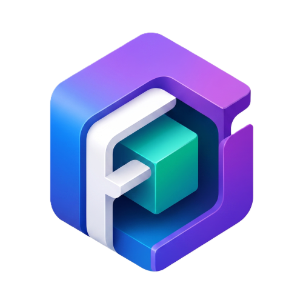

<p align="center">
  
</p>

<h1 align="center">Filion</h1>

<p align="center">
  A Private & Modern 3D viewer app for Android built with Material 3 Expressive.
</p>

<p align="center">
  
  
  
  
  
</p>

> [!NOTE]
> **Privacy Model** Filion does not request `android.permission.INTERNET`. It is fully offline and local.

---

## Why Filion

Filion is a standalone 3D model viewer designed to load and inspect GLB models privately, quickly, and beautifully. It features fluid Material 3 Expressive variable typography, interactive 3D gestures, and a user-selected scanner folder list to bypass traversing folders every time you want to load a model.

---

## Features

| Feature | Description |
|---------|-------------|
| **Interactive 3D View** | Render GLB (glTF binary) models using Filament and Sceneview with smooth rotation, panning, and zoom gestures. |
| **Model Controls Drawer** | Adjust camera zoom, lighting brightness, and select background mode (Theme, Black, or White) through a modern controls panel. |
| **Custom Scan Folders** | Choose custom folders on your device storage to scan. Filion persists folder permissions using the Storage Access Framework (SAF) and lists found models automatically. |
| **Open Custom Model** | Launch the Android system file explorer picker to select and load any GLB file from custom locations. |
| **Metadata Inspection** | View model properties, including display name, formatted size in KB/MB, MIME type, and local path reference. |
| **Intent Viewer Integration** | Launches directly from file managers, download browsers, or messengers when clicking `.glb` files or `model/gltf-binary` contents. |
| **Material 3 Expressive** | Premium dark/light themes, custom shapes, segmented toolbar buttons, and dynamic variable typography utilizing the Google Sans Flex font. |

---

## Tech Stack

| Layer | Technology |
|-------|------------|
| **Language** | Kotlin 2.2.10 |
| **Android Gradle Plugin** | 9.2.1 |
| **UI Framework** | Jetpack Compose BOM 2026.05.00, Material 3 1.5.0-alpha19 |
| **3D Rendering Engine** | Google Filament 1.72.0, Sceneview 4.18.0 |
| **Persistence** | SharedPreferences for storing user-chosen scanner folders |
| **Android Support** | Android 10 or newer (Min SDK 30) |

---

## Quick Start

Download the latest APK from the releases folder or build it directly from source.

### Build Commands

Run Gradle commands from `filion-app/` (`gradlew.bat` may be used instead of `./gradlew` on Windows):

```bash
# Build the debug APK
./gradlew :app:assembleDebug

# Run unit tests
./gradlew :app:testDebugUnitTest

# Build signed, minified release APK
./gradlew :app:assembleRelease
```

Release output:
```text
app/build/outputs/apk/release/Filion-0.0.1.apk
```

Install the debug build on a connected device:
```bash
adb install -r app/build/outputs/apk/debug/app-debug.apk
```

---

## Project Structure

```text
filion/
├── filion-app/
│   ├── app/                                     # App entry point, gradle configurations, and assets
│   │   ├── src/main/java/dev/qtremors/filion/
│   │   │   ├── MainActivity.kt                  # Entry point activity, directory scanner, and Home Screen UI
│   │   │   ├── theme/                           # Color, Theme, Type, and VariableFontFactory setups
│   │   │   ├── ui/                              # Split button, dropdown menu, and helper view components
│   │   │   └── viewer/                          # Sceneview, ModelViewerScreen, overlay layouts, and loaders
│   │   ├── src/main/res/                        # Resources, icons, string keys, and Google Sans Flex font
│   │   └── src/test/java/                       # Unit tests for testing viewer UI states
│   ├── gradle/                                  # Dependency catalog versions
│   ├── gradlew
│   ├── gradlew.bat
│   ├── gradle.properties
│   └── settings.gradle.kts
├── CHANGELOG.md                                 # Stable release changelog
├── DEVELOPMENT.md                               # Architecture & development guide
└── README.md                                    # Main entry point overview
```

---

## License

MIT — see [LICENSE](LICENSE.md) if available.

---

<p align="center">
  Made with ❤️ by <a href="https://github.com/qtremors">Tremors</a>
</p>
