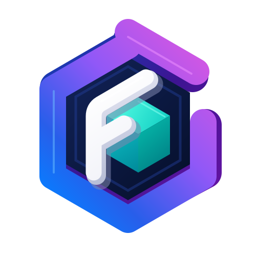

  

<h1 align="center"><a href="https://qtremors.github.io/filion/">Filion</a></h1>

  A private, modern 3D GLB model viewer for Android.

  

  
  

  
  

> [!NOTE]
> **Privacy first:** Filion does not request `android.permission.INTERNET`. Your 3D models and usage data stay on your device.

## Why Filion

Filion is an offline Android 3D model viewer built for inspecting GLB models with smooth touch controls, real-time rendering, and folder scanning. It has no ads, trackers, accounts, network access, or hidden data collection.

## Download

Download the latest APK from [GitHub Releases](https://github.com/qtremors/filion/releases) and install it on a device running Android 10 or newer.

For the best download speed and storage footprint, choose the APK matching your device's CPU architecture:
- **`Filion-0.0.7-arm64-v8a.apk`**: Recommended for modern 64-bit Android phones and tablets (~12.6 MB).
- **`Filion-0.0.7-armeabi-v7a.apk`**: 32-bit ARM devices (~11.1 MB).
- **`Filion-0.0.7-x86_64.apk`**: 64-bit x86 emulators and Chromebooks (~13.1 MB).
- **`Filion-0.0.7-x86.apk`**: 32-bit x86 emulators (~13.2 MB).
- **`Filion-0.0.7.apk`**: Universal APK containing all architectures (~31.5 MB).

## Features

- **Private and offline:** No ads, accounts, trackers, data collection, or internet permission.
- **3D model inspection:** Rotate, pan, and zoom GLB models with responsive touch gestures.
- **Lighting and environment:** Adjust scene brightness and switch between theme, dark, and light backgrounds.
- **Custom folder scans:** Choose folders through Android Storage Access Framework, scan for GLB models recursively, and manage folder grants.
- **System intent integration:** Open `.glb` files directly from file managers, downloads, or external applications via `ACTION_VIEW` intents.
- **Model information:** Inspect model file names, byte sizes, MIME types, and document URI references.
- **Sharing and export:** Share models or open them in other compatible applications without exposing private paths.
- **Material 3 UI:** Dynamic Material You coloring with system, light, and dark theme support.

## Community and support

- Join the [Discord community](https://discord.gg/QgUjuNj9U8).
- Report bugs or request features through [GitHub Issues](https://github.com/qtremors/filion/issues).
- Review changes in the [changelog](CHANGELOG.md).
- Read the [privacy policy](PRIVACY.md).

## Credits

Filion is built by [Tremors](https://github.com/qtremors) with Kotlin and the Android platform. Thanks to the maintainers of:

- [Google Filament](https://github.com/google/filament) and [SceneView](https://github.com/SceneView/sceneview) for 3D graphics rendering and GLTF/GLB loading
- [AndroidX](https://developer.android.com/jetpack/androidx), [Jetpack Compose](https://developer.android.com/compose), and [Material 3](https://m3.material.io/)
- [Kotlin](https://kotlinlang.org/) and [Kotlin Coroutines](https://github.com/Kotlin/kotlinx.coroutines)

The app's **Settings -> About -> Open Source Licenses** screen lists its runtime libraries and their licenses. Third-party notices are documented in [THIRD_PARTY_NOTICES.md](THIRD_PARTY_NOTICES.md).

## For developers

Architecture, project structure, technology choices, setup, build commands, testing, convention checks, and release signing live in [DEVELOPMENT.md](DEVELOPMENT.md).

## License

Filion is available as open source under the [MIT License](LICENSE.md).

---

  Made by <a href="https://github.com/qtremors">Tremors</a>

